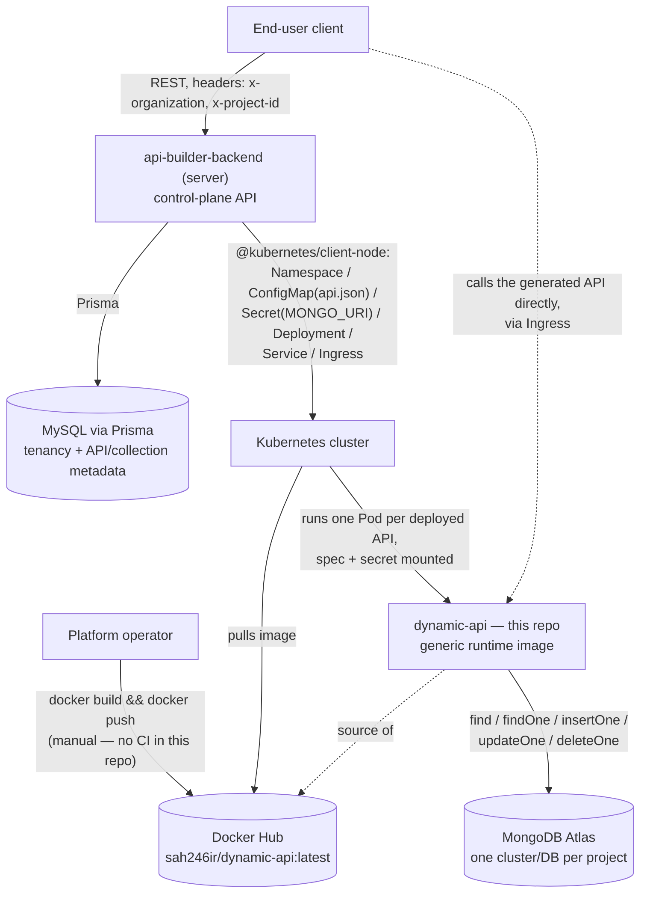
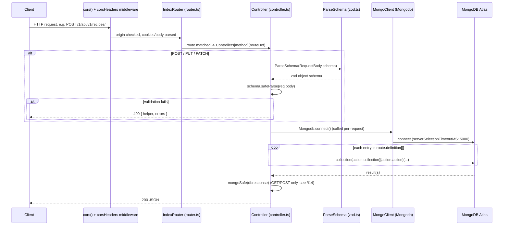
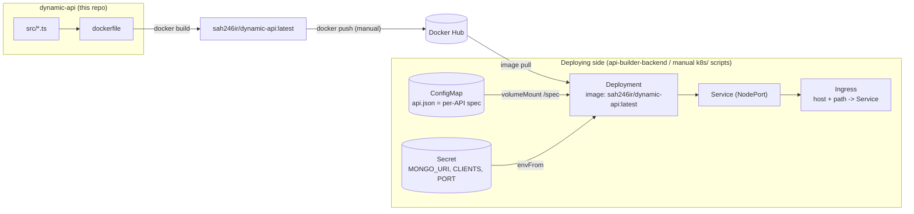

# dynamic-api

The generic, spec-driven runtime container for the **api-builder** Backend-as-a-Service (BaaS) platform. This repository does not build other services' containers or orchestrate Kubernetes itself — it *is* the container image (`sah246ir/dynamic-api`) that the platform's control plane builds once and deploys, unmodified, one Kubernetes `Deployment` per user-defined API. What differs between deployments is not code, but a single mounted JSON file (`api.json`) describing endpoints, MongoDB actions, and request schemas.

---

## 1. What this service is responsible for

Given an `api.json` spec (endpoint paths, HTTP methods, target MongoDB collections/actions, and optional request-body schemas), this process:

1. Reads that spec once at startup from a local file path (`SPEC_PATH`).
2. Dynamically builds an Express router — one route per spec entry — instead of hand-written route handlers.
3. For each incoming request, validates the body (when a schema is defined) with a `zod` schema built on the fly from that spec, then executes the corresponding MongoDB operation(s) against a project-specific Atlas cluster.
4. Returns the (BSON-safe-serialized) result as JSON.

It has **no knowledge of "users," projects, or tenants** beyond what's encoded in the mounted spec and connection string — every concept of ownership, authentication headers, and deployment orchestration lives in the sibling control-plane repository, `api-builder-backend` (`server/` in this workspace).

## 2. Where it sits in the BaaS architecture



Concretely: `api-builder-backend` persists API/collection definitions in MySQL, and — on a deploy request — provisions this image into the cluster and hands it configuration entirely through a Kubernetes `ConfigMap` and `Secret`. This repo never talks to MySQL, Redis, or the control-plane API. It only ever sees a local `api.json` file and a MongoDB connection string.

## 3. Tech stack

| Technology | Role |
|---|---|
| **TypeScript + Express 4** | HTTP server; routes are generated, not statically declared. |
| **`ts-node`** | Executes `src/index.ts` directly in production — there is no compiled-JS entry point used at runtime (see §7, §14). |
| **MongoDB Node driver (`mongodb` 6.x)** | Direct collection-level CRUD (`find`, `findOne`, `insertOne`, `updateOne`, `deleteOne`) — no ODM/schema layer on the DB side. |
| **`zod`** | Builds request-body validators at runtime from the `FieldSchema[]` arrays embedded in `api.json`, including nested objects and arrays. |
| **`cors` + `cookie-parser` + `body-parser`** | Standard Express middleware stack; CORS origins come from the `CLIENTS` env var. |
| **`dotenv`** | Loads `.env` in both `src/api.ts` and `src/index.ts` independently. |
| **Docker (`node:18-slim`)** | Single-stage image; see §7. |

## 4. Folder structure

```
dynamic-api/
├── api.json                       # Sample/local API spec (endpoint defs, Mongo actions, schemas)
├── dockerfile                     # Single-stage production image
├── src/
│   ├── index.ts                   # Express app entry point: middleware, CORS, MongoClient, listen
│   ├── api.ts                     # Loads and parses the spec file at SPEC_PATH (sync, at import time)
│   ├── router.ts                  # Builds Express routes from apiRouteDefinition.ApiEndpoint
│   ├── controller.ts              # One controller factory per HTTP method (GET/POST/PUT/PATCH/DELETE)
│   ├── zod.ts                     # ParseSchema(): FieldSchema[] -> zod object schema (recursive)
│   ├── types.ts                   # ApiRouteDefinition / ApiEndpoint / FieldSchema types
│   ├── utile.ts                   # mongoSafe(): BSON-safe JSON serialization
│   ├── initialize.ts              # Unused stub — see §14, §18
│   ├── queryManager.tsx           # Empty file, unused
│   └── Middlewares/
│       └── cors-headers.ts        # Manually re-sets Access-Control-* headers
├── dist/                          # Committed, compiled output — not used by the Docker image (see §7)
├── .env.example
├── tsconfig.json                  # NodeNext, strict, rootDir=src, outDir=dist
└── package.json
```

## 5. Spec-driven routing

`src/api.ts` reads `SPEC_PATH` synchronously, once, at module load:

```ts
const apiRouteDefinitionJson = JSON.parse(fs.readFileSync(resolvedPath, "utf-8"));
```

There is no hot-reload — changing the mounted file requires a process restart (in Kubernetes: a rolling restart, which is exactly what the control plane's `RedeployApi` flow does after patching the `ConfigMap`).

`src/router.ts` then iterates every entry in `ApiRouteDefinition.ApiEndpoint`:

- The Express method (`get`/`post`/`put`/`delete`/`patch`) is picked dynamically off `IndexRouter` based on `route.method`.
- The final path is built as `` /{spec.id}{spec.endpoint}{route.endpoint} ``, with `{param}` placeholders rewritten to Express's `:param` syntax — e.g. `id: "1"`, `endpoint: "/api/v1/recipes"`, `route.endpoint: "/{id}"` becomes `/1/api/v1/recipes/:id`. The leading numeric `id` prefix is what allows multiple API specs to coexist under one path scheme.
- Each route is wired to `Controllers[route.method](route)` — a controller **factory** closed over that one route's definition (§6 in `controller.ts`).

Request-body validation schemas are built the same way, on demand, by `ParseSchema()` (`src/zod.ts`): it walks `FieldSchema[]`, mapping each `{ type, field, required }` to `z[type]()`, recursing into nested `z.object(...)` when `type` is itself an array of field definitions, and wrapping in `z.array(...)` when `array: true`.

## 6. Request lifecycle



Per-method behavior, as implemented today:

| Method | Behavior |
|---|---|
| `GET` | Runs every action in `route.definition[]` with an empty filter `{}` and always calls `.toArray()` on the result. Ignores `filterBy` and `req.params` entirely — see §17 for why this breaks `findOne`. |
| `POST` | Validates `req.body` against the generated schema, then runs each `definition[]` action (typically `insertOne`) with the parsed data. |
| `PUT` / `PATCH` | Validates `req.body`, then runs each action as `updateOne({ _id: new ObjectId(req.params.id) }, { $set: data })`. The filter is hardcoded to `_id`/`req.params.id`, not derived from the spec's `filterBy`. |
| `DELETE` | Runs `deleteOne({ _id: new ObjectId(req.params.id) })` for each action but always responds with `res.json([])`, discarding the driver's result. |

## 7. Docker build process

```dockerfile
FROM node:18-slim
WORKDIR /app
RUN apt-get update && apt-get install -y ca-certificates && rm -rf /var/lib/apt/lists/*
COPY package*.json ./
RUN npm ci --only=production
COPY . .
ENV PORT=5000
ENV SPEC_PATH="api.json"
ENV MONGO_URI="mongodb+srv://..."   # baked-in placeholder — see §17
EXPOSE 5000
CMD ["npm", "run", "start"]
```

Notable facts about this build, verified against the repo:

- **Single stage, no TypeScript compilation.** `npm run start` runs `ts-node src/index.ts` directly — the image ships full TypeScript source, `@types/*` packages, and `ts-node` itself into what is nominally a "production" install, and transpiles on every process start rather than shipping compiled JS.
- **`dist/` is dead weight.** The repo has a committed `dist/` directory (compiled via `npx tsc -b` at some point), but `.dockerignore` excludes it from the build context, and nothing in the `CMD` references it. It is neither used by the container nor kept in sync with `src/`.
- **`ts-node` is a `dependencies` entry** (not a `devDependency`), which is why it survives `npm ci --only=production`. `typescript` itself is not declared anywhere in `package.json` — it's present in `node_modules` only because `ts-node` lists it as a `peerDependency` and npm's automatic peer-install happens to satisfy it. Production execution is therefore implicitly dependent on npm's peer-resolution behavior, not an explicit pinned dependency.
- **Secrets and config are baked into the image** via `ENV` instructions (`MONGO_URI`, `SPEC_PATH`, `PORT`). In practice these are always overridden at deploy time by a Kubernetes `Secret`/`ConfigMap` (§10), but the image is not safe to run as-is without that override, and a real MongoDB connection string is committed to this Dockerfile in version control.

## 8. Image generation & publishing

There is **no CI/CD in this repository** — no GitHub Actions, no build pipeline file of any kind. Producing and publishing `sah246ir/dynamic-api:latest` is a manual, undocumented step performed outside this repo:

```bash
docker build -t sah246ir/dynamic-api:latest .
docker push sah246ir/dynamic-api:latest
```

The image name is not configurable from here — it's hardcoded on the *consumer* side, in `api-builder-backend`'s `constants.ts` (`k8S_DEPLOYMENT(...)`), always as the `:latest` tag. There is no version pinning, so every namespace's pods eventually converge on whatever was last pushed, and a bad push has no rollback path other than pushing a fixed image and forcing a rolling restart.

## 9. Deployment pipeline & process

This repo produces the artifact; it does not deploy it. Deployment is entirely driven by `api-builder-backend`'s `K8sUtils` service, triggered by its `POST /api/v1/deployments/deploy/:apiId` endpoint (BullMQ job → Kubernetes API calls). From this repo's point of view, "deploying" means: an operator/consumer of this image creates the following four Kubernetes objects, all observable in this workspace's `k8s/` reference manifests:



Two things provision this same shape today:

1. **`api-builder-backend`'s `K8sUtils`** (`services/k8.ts`/`k8.utils.ts`, `@kubernetes/client-node`) — the production path, driven by the deploy API and documented in that repo's README.
2. **This workspace's `k8s/` directory** (`deployment.yaml`, `ingress.yaml`, `namespace-setup.sh`, `namespace-cleanup.sh`) — a manual, `kubectl`-scripted reference setup used to stand up one instance (`test-user` namespace, `api-test` Deployment/Service/Ingress) directly from this repo's `api.json`, useful for testing the image in isolation without running the full control plane. **`namespace-setup.sh` hardcodes a real MongoDB Atlas connection string via `--from-literal=MONGO_URI=...`** — fine for a disposable local cluster, not something to reuse verbatim.

Both paths result in the same runtime contract: one Pod running this image, `SPEC_PATH` pointed at a mounted `api.json`, and Mongo/CORS/port config supplied via environment variables — nothing about this image itself is deployment-specific.

## 10. Kubernetes integration

From `k8s/deployment.yaml` / `ingress.yaml` (the concrete reference this repo is tested against):

- **Image**: `sah246ir/dynamic-api:latest`, one container per Pod, `replicas: 1`.
- **Config delivery**: the spec file is never baked into the image for a real deployment — it's mounted as a `ConfigMap` volume at `/spec`, with `SPEC_PATH=/spec/api.json` overriding the Dockerfile's baked-in default.
- **Secrets**: `MONGO_URI`, `CLIENTS`, `PORT` come from a Kubernetes `Secret` via `envFrom.secretRef`, not from the image.
- **Networking**: the container listens on `5000` internally; a `NodePort` `Service` exposes port `80 -> 5000`; an `Ingress` (`host`-based, `path: /`, `Prefix`) fronts the `Service`.
- **No liveness/readiness probes, no resource requests/limits, no `replicas` > 1** are defined anywhere in the manifests this repo is validated against — a crashed or wedged process (e.g. the `SPEC_PATH` throw at startup, §11) has no automated recovery signal beyond the container exiting and the kubelet's default restart policy.

## 11. Failure handling

- **Startup-time failures are fatal and unrecoverable by design.** `src/api.ts` throws synchronously if `SPEC_PATH` is unset or the file is unreadable/invalid JSON — this happens at module import, before the Express server binds, so the process exits immediately. There's no fallback spec and no retry.
- **Mongo connection has a fixed 5s `serverSelectionTimeoutMS`** and is otherwise unconfigured — a slow or unreachable Atlas cluster fails the specific request that triggered `Mongodb.connect()`, not the whole process.
- **Every controller wraps its body in try/catch** and, on any exception, returns a flat `500 { errors: ["unknown error"] }` — Zod validation errors, Mongo errors, and programming bugs are all indistinguishable to the caller except for the one explicit `400` branch on `safeParse` failure.
- **No circuit breaking, no retries, no dead-letter handling** for failed Mongo operations — a single bad action in `route.definition[]` throws and aborts the whole request, discarding any earlier successful actions in that same loop (there's no transaction).
- **No process-level supervisor** (no `pm2`, no restart-on-crash logic) inside the image — recovery from a crash relies entirely on the container orchestrator's restart policy.

## 12. Logging

Logging is `console.log`/`console.error` only, scattered directly in `controller.ts` (e.g. every action is logged before execution, every caught error is logged with a method-specific prefix). There is:

- No log levels, no structured/JSON logging, no request IDs.
- No correlation with the control plane's `DeploymentLog` table or `LogManager` — that observability layer exists entirely in `api-builder-backend` and only covers the *deployment* of this container, not what happens once it's running. Runtime request logs from this service go nowhere but the container's stdout, wherever the cluster happens to collect that (not configured in this repo).

## 13. Communication with the backend

There is **no live network channel** between this service and `api-builder-backend` at runtime. The relationship is entirely one-directional and mediated by Kubernetes objects, not API calls:

- The control plane writes a `ConfigMap` (spec) and `Secret` (Mongo URI, CORS origins, port) once, at deploy/redeploy time.
- This process reads those as a mounted file and environment variables at startup only.
- This service never calls back into `api-builder-backend` — no health pings, no status reporting, no webhook. If a redeploy patches the `ConfigMap`, this process only picks it up after being restarted (the control plane's `RedeployApi` flow explicitly annotates the `Deployment` to force that rolling restart).
- Both services independently talk to MongoDB Atlas, but never to each other directly.

## 14. Important engineering decisions

- **One generic image, infinite behaviors via mounted config.** Rather than generating and building bespoke code per API, the platform keeps a single container image and drives all behavioral differences through `api.json` + env vars. This keeps the image simple and the control plane stateless with respect to generated logic, at the cost of every API sharing the exact same runtime code, error handling, and validation behavior — a bug here affects every deployed API on that image tag simultaneously.
- **`ts-node` in production instead of a compiled build.** Simpler Dockerfile (no separate build stage), at the cost of a larger image, slower cold start (JIT-compiling TypeScript on every process boot), and a production runtime dependency on `ts-node`/`typescript` being present — see §7.
- **Mongo connection is established per-request** (`Mongodb.connect()` inside every controller invocation) rather than once at startup. The driver's `MongoClient.connect()` is safe to call repeatedly, but this pattern still adds unnecessary work to the hot path instead of connecting once and reusing a pooled client.
- **`filterBy` and `QueryParams` are declared in `types.ts` but never read anywhere in `controller.ts`.** The spec format anticipates per-field filtering and query-param validation; the implementation hardcodes `_id`/`req.params.id` for mutations and no filter at all for reads. The spec is ahead of the code here.
- **`src/initialize.ts` is a complete no-op stub**, never imported or called. Its TODOs describe a materially different architecture than what exists today: fetching the API schema from MongoDB (instead of a local file), pulling code snippets/dependencies from S3 at startup, and reading `USERID`/`APIID` env vars. None of that is wired in — the current implementation is entirely "spec is a local file, no per-tenant code."
- **`body-parser` is imported directly in `src/index.ts` but is not a declared dependency** in `package.json` — it resolves today only because it's a transitive dependency of `express`. This works, but is one `express` version bump away from breaking.
- **`export let client: Db` in `src/index.ts` is declared and exported but never assigned or used anywhere** — likely intended as a shared, connected `Db` handle, superseded by the current per-request `Mongodb.connect()` pattern in `controller.ts` without removing the dead export.

## 15. Local setup

```bash
git clone https://github.com/sah246ir/api-builder-container-api.git dynamic-api
cd dynamic-api
npm install
cp .env.example .env
# edit .env: set MONGO_URI to a real Atlas connection string,
# set SPEC_PATH to a valid api.json (a sample is committed at the repo root),
# set CLIENTS to your frontend origin(s)
npm run start
```

`npm run start` runs `ts-node src/index.ts` directly — there is no watch mode configured (no `nodemon`/`ts-node-dev`), so the process must be restarted manually after each change. There is no `build` script in `package.json`; the committed `dist/` output was produced by manually running `npx tsc -b` and is not kept up to date automatically. There is no test suite — `npm test` is the default placeholder (`exit 1`).

To exercise this image the way it actually runs in the cluster, use the reference manifests in the workspace's `k8s/` folder against a local cluster (e.g. `minikube`/`kind`):

```bash
cd ../k8s
./namespace-setup.sh     # creates namespace, ConfigMap from ../dynamic-api/api.json, Secret, Deployment, Service, Ingress
# ...
./namespace-cleanup.sh   # deletes the whole test-user namespace
```

## 16. Environment variables

| Variable | Required | Read in code | Notes |
|---|---|---|---|
| `SPEC_PATH` | **Yes** | `src/api.ts` | Path to the JSON route-definition file. Process throws synchronously at startup if unset. In Kubernetes this is a mounted `ConfigMap` path (`/spec/api.json`), not a bundled file. |
| `MONGO_URI` | **Yes** (functionally) | `src/index.ts` | Falls back to `""` if unset, which produces a non-functional `MongoClient`. No connection-string validation at startup. |
| `PORT` | **Yes** (functionally) | `src/index.ts` | Passed directly to `app.listen(process.env.PORT, ...)`; no explicit default in code (the Dockerfile and deploy-time `Secret` both set it to `5000`). |
| `CLIENTS` | No | `src/index.ts`, `Middlewares/cors-headers.ts` | Comma-separated list of allowed CORS origins. Defaults to `""` (empty array) if unset, which allows no cross-origin browser clients. |
| `USERID`, `APIID` | No — unused | `src/initialize.ts` only | Read by the dead `InitializeApi()` stub (§14, §18); not consumed by any code path that actually runs. |

## 17. Current limitations

- **The `GET /{id}` (`findOne`) endpoint is broken as implemented.** `CreateGetController` unconditionally calls `.toArray()` on every action's result, but `Collection.findOne()` resolves to a document (or `null`), not a cursor — this throws and is swallowed by the generic `catch`, returning `500 { errors: ["unknown error"] }` for any endpoint whose `definition` uses `findOne`.
- **`filterBy` and `QueryParams` from the spec are entirely unused.** Reads ignore `req.params`/query strings and always query with `{}`; writes hardcode `_id: new ObjectId(req.params.id)` regardless of what `filterBy` declares. Any spec relying on filtering by a field other than `_id`, or on query-param-driven filtering, has no effect.
- **`mongoSafe()`'s BSON type check has a typo.** It compares `value?._bsontype === "ObjectID"`, but the installed `bson` package tags ObjectId instances as `"ObjectId"` (lowercase `d`) — this branch never matches. It's currently harmless in practice because `ObjectId` has its own `toJSON()` that `JSON.stringify` already calls, but the intended explicit-conversion branch is dead code.
- **Real credentials are committed to version control** in both `dockerfile` (`ENV MONGO_URI=...`) and the workspace's `k8s/namespace-setup.sh` (`--from-literal=MONGO_URI=...`). Anyone with read access to either repo/workspace has a live MongoDB Atlas connection string.
- **`PUT`/`PATCH` responses skip `mongoSafe()`** (only `GET`/`POST` call it) — an update whose result contains BSON types (e.g. `Decimal128`) can produce a response the client can't safely `JSON.parse` in the way `GET`/`POST` responses are guaranteed to be.
- **`DELETE` discards its own result** — it always responds `200 []`, so a delete against a non-existent `_id` and a successful delete are indistinguishable to the caller.
- **No authentication or authorization at all.** Anything that can reach the container's `Ingress`/`Service` can call every route the mounted spec exposes; there is no equivalent of the control plane's (also unenforced) `ApiEndpoint.authentication` flag on this side.
- **No health/readiness endpoints**, no graceful shutdown handling (`SIGTERM` is not caught — in-flight Mongo operations are not drained before the process exits).
- **Single replica, `:latest` tag, no rollback path** — see §8, §10.
- **`dist/` is stale and unused**; `body-parser` is an undeclared dependency; `typescript` is present only via peer-dependency auto-install (§7, §14).
- **No CI, no automated tests, no linting configured in this repo.**

## 18. Future improvements

Roughly in the order the code itself already hints at (via `initialize.ts`'s TODOs and the gaps above):

1. Fix the `findOne` / `.toArray()` bug and wire `filterBy`/`QueryParams` into the GET and mutation controllers so the spec's declared filtering actually takes effect.
2. Fix the `mongoSafe()` `"ObjectID"` typo and apply `mongoSafe()` consistently across all five controllers, including `DELETE`'s discarded result.
3. Move `SPEC_PATH`-driven local-file loading toward the model `initialize.ts` already sketches: fetch the schema from a data store and any per-API code/dependencies from object storage (S3) at startup, keyed by `USERID`/`APIID`, instead of relying purely on a mounted `ConfigMap`.
4. Replace `ts-node`-in-production with a real multi-stage Docker build (`tsc` in a build stage, copy only `dist/` + production `node_modules` into the final image), remove the unused committed `dist/`, and declare `typescript`/`body-parser` explicitly.
5. Stop baking a real `MONGO_URI` into the Dockerfile and `namespace-setup.sh`; require it to be supplied only via a mounted `Secret`, with no functional default.
6. Add liveness/readiness probes and graceful `SIGTERM` handling so the Kubernetes layer can actually detect and recover from a wedged or crashed process.
7. Add authentication/authorization enforcement per endpoint (tying into the control plane's currently-unenforced `ApiEndpoint.authentication` flag).
8. Add structured logging (levels, request IDs) and, ideally, a way to correlate runtime request logs with the control plane's deployment/log history.
9. Add CI: build + tag images automatically (with real version tags instead of a single moving `:latest`), and run at least a basic test suite before publishing.
10. Add explicit resource requests/limits and support for `replicas > 1` in the reference Kubernetes manifests, once the per-request Mongo connection pattern is confirmed safe under concurrent pods.
